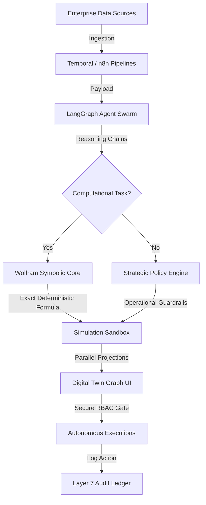

# Sanktrix

**Autonomous Decision Intelligence Operating System**

[](https://santrix-two.vercel.app/)
[](https://santrix-two.vercel.app/)
[](https://www.typescriptlang.org/)
[](https://nextjs.org/)

**Live Demo:** [https://santrix-two.vercel.app/](https://santrix-two.vercel.app/)

---

## 2. Problem Statement

Modern enterprise leaders face a systemic flaw in their decision-making apparatus: **latency between data aggregation and strategic execution.** Traditional Business Intelligence (BI) tools are purely retrospective—they render static dashboards of what happened yesterday but fail to calculate *why* it happened or *how* to optimize future actions.

Furthermore, while Large Language Models (LLMs) provide advanced reasoning, they suffer from hallucinations and non-deterministic behavior. A Fortune 500 company cannot base its supply chain routing or capital burn allocation on speculative next-token predictions. A rigorous, mathematically sound operating core is required.

## 3. Solution

**Sanktrix** bridges the gap between **neural reasoning** (AI agents) and **symbolic computation** (Wolfram Language). 

We provide a glassmorphic, low-latency command center where an orchestration of autonomous agents delegates all complex mathematics, risk profiling, and Monte Carlo simulations directly to a deterministic computational engine. Sanktrix doesn't just display data—it actively runs enterprise simulations, identifies risk propagation, and executes strategic policies automatically.

## 4. Key Features

* **Executive Copilot:** Your AI boardroom advisor. Ask strategic "what-if" questions and receive data-driven analysis, probability forecasts, and actionable recommendations.
* **Digital Twin (Impact Map):** A live visualization of your enterprise topology. Simulate how a risk in one node (e.g., Marketing Churn) propagates downstream to Engineering and Sales in real-time.
* **Knowledge Graph:** A semantic linking of abstract entities (risks, events, datasets) evaluated by the Wolfram Engine to surface non-obvious operational insights.
* **AI Workforce:** Monitor specialized autonomous agents (Finance, Strategy, Operations) as they reason, collaborate, and execute workflows asynchronously.
* **Business Simulations (Scenario Lab):** Run high-fidelity business stress tests (like Revenue Forecasts or Burn Rate Crises) to prepare the enterprise for multiple future realities.
* **Event Fabric:** A chronological ledger capturing every single transaction and telemetry ping running through the enterprise ecosystem.
* **Intelligence Feed:** Real-time curated insights, market shifts, and internal threshold alerts synthesized directly for the C-Suite.
* **Wolfram Computation Engine:** The core mathematical kernel executing parametric equations, Monte Carlo trials (n=50,000), and symbolic calculus.

## 5. Architecture

Sanktrix utilizes a fluid-fixed computational loop, cleanly decoupling reasoning from computation.



## 6. Technology Stack

* **Frontend:** Next.js 16 (App Router, Turbopack), React 19, TypeScript, Vanilla CSS (PostCSS), TailwindCSS.
* **Backend:** Next.js Server Actions, Node.js.
* **AI Layer:** LangGraph Orchestration, OpenAI / Anthropic APIs, CrewAI Swarms.
* **Data Layer:** Supabase, PostgreSQL, Pinecone (Vector Semantic Indexing), ClickHouse (Telemetry).
* **Infrastructure:** Vercel (Edge Network), Docker, Wolfram Alpha APIs.

## 7. Why Sanktrix?

* **Deterministic Precision:** We never guess. All math and risk calculations are routed to Wolfram, ensuring 100% mathematical certainty.
* **RBAC-Gated Automation:** Sanktrix acts autonomously but requires multi-signature cryptographic approval before executing high-risk financial or operational tasks.
* **Boardroom Ready:** The UI/UX is built specifically for the C-Suite. It turns raw engineering data into actionable strategic intelligence via an immersive, premium aesthetic.

## 8. Screenshots

*(View the live demo at [https://santrix-two.vercel.app/](https://santrix-two.vercel.app/) to experience the fully animated, responsive Executive Command Center.)*

## 9. Local Setup

### Prerequisites
* Node.js v20.x or higher
* npm v10.x or higher

### Installation

1. Clone the repository:
   ```bash
   git clone https://github.com/karanscosmo/santrix.git
   cd santrix
   ```

2. Install dependencies:
   ```bash
   npm install
   ```

3. Configure environment variables:
   ```bash
   cp .env.example .env.local
   ```

4. Run the development server:
   ```bash
   npm run dev
   ```
   Open [http://localhost:3000](http://localhost:3000) to view the application.

## 10. Environment Variables

Your `.env.local` should contain:

```ini
# Core
NEXT_PUBLIC_API_URL=http://localhost:3000

# AI & Computation
OPENAI_API_KEY=your_openai_api_key
WOLFRAM_APP_ID=your_wolfram_app_id
WOLFRAM_KERNEL_URL=https://api.wolframalpha.com/v1/result

# Integrations
N8N_WEBHOOK_URL=https://your-n8n-instance.com/webhook/sanktrix
```
*(Note: Never commit your `.env.local` file to version control. Use `.env.example` as a template.)*

## 11. Deployment

### Vercel Deployment (Recommended)
Sanktrix is highly optimized for Edge deployment via Vercel:
1. Push your repository to GitHub.
2. Import the project into Vercel.
3. Configure your Environment Variables in the Vercel dashboard.
4. Deploy! Vercel will automatically run `npm run build`.

### Docker Deployment
A `Dockerfile` and `docker-compose.yml` are included for isolated containerized environments:
```bash
docker-compose up -d --build
```

## 12. Future Roadmap

1. **On-Premise Private LLM Support:** Add configurations to swap commercial endpoints with locally hosted models (e.g., Llama-3) for zero-trust environments.
2. **Persistent WebSockets:** Establish persistent bidirectional streaming to remote Wolfram Engines for sub-10ms math execution.
3. **Tamper-Proof Ledger Logging:** Sync audit logs to private database chains for immutable operations records.

## 13. Team

**Karan Sharma**  
*Principal System Architect & Lead Engineer*  
GitHub: [karanscosmo](https://github.com/karanscosmo)
