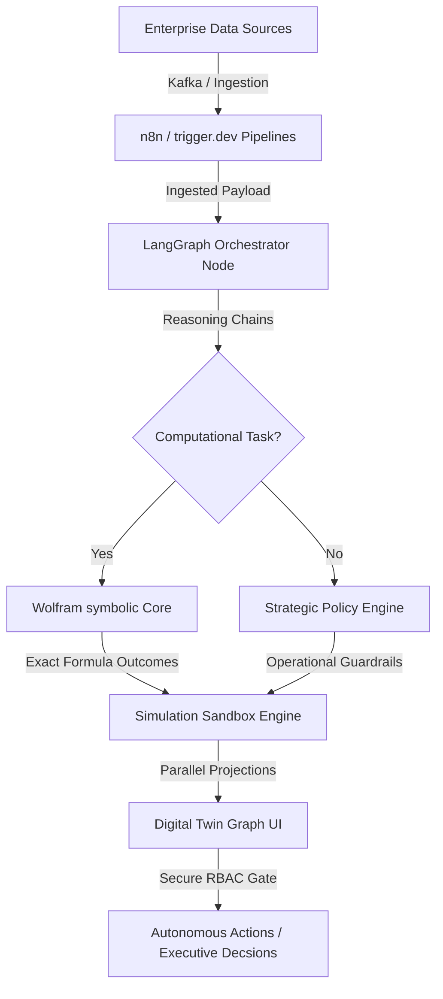

# Sanktrix OS

### Autonomous Computational Intelligence Platform for Enterprise Decision-Making

---

Sanktrix is an enterprise-grade Operating System designed to orchestrate autonomous AI agent workflows, perform high-fidelity symbolic computations, and execute real-time business simulations. By integrating enterprise data streams with n8n pipelines, LangGraph coordination swarms, and the Wolfram Language, Sanktrix replaces static BI dashboards with active, audited strategic intelligence.

Live Deployment: [https://santrix-two.vercel.app/](https://santrix-two.vercel.app/)

---

## 1. Problem Statement
Traditional Business Intelligence (BI) tools are historically retrospective. They render static data dashboards representing what happened in the past but fail to explain *why* it happened or *how* to optimize future trajectories. 

Furthermore, modern Large Language Models (LLMs) used for decision-making suffer from non-deterministic reasoning, hallucinations, and a lack of computational precision. An enterprise cannot base its supply chain routing, capital allocation, or risk profiling on speculative next-token predictions.

---

## 2. The Solution
Sanktrix bridges the gap between **neural reasoning** (AI agents) and **symbolic computation** (Wolfram Language).

* **Deterministic Computation:** AI agents reason about strategy, but delegate all math, forecasts, optimizations, and simulations to the Wolfram Language.
* **Continuous Simulation:** Sanktrix constantly stress-tests operations by running parallel Monte Carlo simulations to calculate risk distributions.
* **Active Execution:** Instead of waiting for human intervention, Sanktrix models recommendations, gates them via a granular RBAC approval chain, and triggers automated integrations.

---

## 3. Architecture & System Flow

The Sanktrix platform utilizes a fluid-fixed computational loop:



---

## 4. Wolfram Language Integration

Sanktrix queries the Wolfram Kernel to compute deterministic solutions for operations research:

* **Monte Carlo Simulations:** Evaluates probability spreads on business runways and customer churn.
* **Non-Linear Optimization:** Computes optimal resource scheduling and logistics routes.
* **Symbolic Logic Verification:** Validates that agent reasoning steps adhere to mathematical proofs.

Example expression evaluated by the Sanktrix-Wolfram compiler:
```mathematica
NIntegrate[Runway[v], {v, 0, ChurnVariance}]
```

---

## 5. AI Agent System

Sanktrix deploys a multi-agent swarm using LangGraph to partition operational concerns:

1. **Finance Agent:** Tracks real-time cash flow, burn rate, and optimizes departmental spend allocations.
2. **Forecasting Agent:** Predicts demand curves and automates inventory buffer sizes.
3. **Strategy Agent:** Generates competitive SWOT models and outlines market expansion scenarios.
4. **Risk Agent:** Audits compliance nodes and triggers alert flags when risk thresholds exceed boundaries.
5. **Operations Agent:** Reroutes freight logistics and schedules warehouse shifts.
6. **Wolfram Agent:** Coordinates API compile cycles and acts as the gatekeeper to the symbolic kernel.

---

## 6. Tech Stack

* **Framework:** Next.js 16 (App Router, Turbopack)
* **Frontend:** React 19, TypeScript, Vanilla CSS (PostCSS)
* **Graphics:** WebGL (Custom fragment shader backgrounds), SVG Graphing
* **Testing:** Playwright (E2E), Vitest (Unit / Component)
* **Security:** Cryptographic JWT Session Management, RBAC Gating
* **Deployment:** Vercel Staging Pipelines, Docker Orchestration

---

## 7. Folder Structure

```
.
├── src/
│   ├── app/               # Next.js App Router (pages & layouts)
│   ├── components/        # Reusable UI components (Sidebar, WebGLBackground, layout wrappers)
│   ├── context/           # Security and state providers
│   ├── features/          # Planned feature-specific components
│   │   ├── agents/
│   │   ├── wolfram/
│   │   └── simulations/
│   ├── services/          # External API layer (Wolfram, n8n)
│   ├── lib/               # Shared libraries
│   ├── hooks/             # Custom React hooks
│   ├── types/             # TypeScript declaration files
│   ├── utils/             # Helper utilities
│   └── test/              # Vitest test cases
├── public/
│   └── branding/          # Official transparent logo PNG assets
├── e2e/                   # Playwright E2E integration tests
├── docs/                  # API and design specifications
└── workflows/             # n8n pipeline json templates
```

---

## 8. Installation & Setup

### Prerequisites
* Node.js v20.x or higher
* npm v10.x or higher

### Local Installation

1. Clone the repository:
   ```bash
   git clone https://github.com/karanscosmo/santrix.git
   cd santrix
   ```

2. Install dependencies:
   ```bash
   npm install
   ```

3. Set up environment variables:
   ```bash
   cp .env.example .env.local
   ```

4. Run the development server:
   ```bash
   npm run dev
   ```
   Open [http://localhost:3000](http://localhost:3000) to view the application.

---

## 9. Environment Variables

Configure the following variables in `.env.local`:

```ini
# Core API Gateways
NEXT_PUBLIC_API_URL=http://localhost:3000

# Wolfram Symbolic Core API
WOLFRAM_APP_ID=your_wolfram_app_id
WOLFRAM_KERNEL_URL=https://api.wolframalpha.com/v1/result

# n8n / Workflow Integration
N8N_WEBHOOK_URL=https://your-n8n-instance.com/webhook/sanktrix
```

---

## 10. Running Test Pass

### Unit Tests
Execute unit assertions with Vitest:
```bash
npm run test
```

### E2E Tests
Run E2E route navigation tests with Playwright:
```bash
npm run test:e2e
```

---

## 11. Deployment

Sanktrix is configured to deploy instantly on Vercel:

1. Connect your repository to Vercel.
2. Configure environment variables in the Vercel dashboard.
3. Vercel automatically runs the build optimization:
   ```bash
   npm run build
   ```

---

## 12. Future Scope
* **Live Wolfram Kernel Integration:** Establish persistent WebSockets to remote Wolfram Engines.
* **On-Premise Private LLM Support:** Add configurations to swap commercial endpoints with private Llama-3 nodes.
* **Tamper-Proof Ledger Logging:** Sync audit logs to private database chains for unalterable operations records.

---

## 13. Team
* **Karan Sharma** — Principal System Architect & Lead Engineer (karanscosmo)
